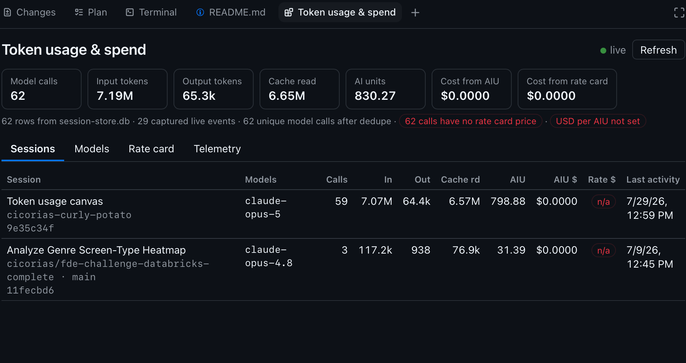
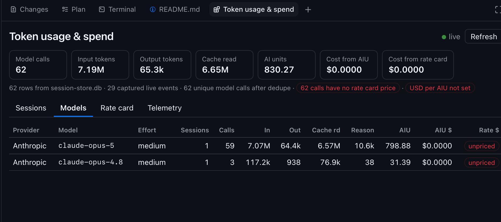
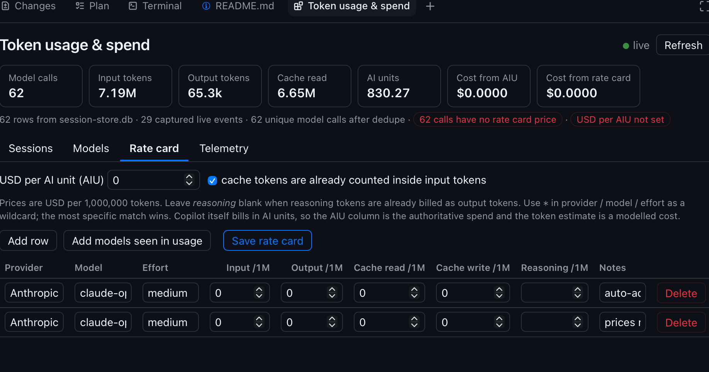
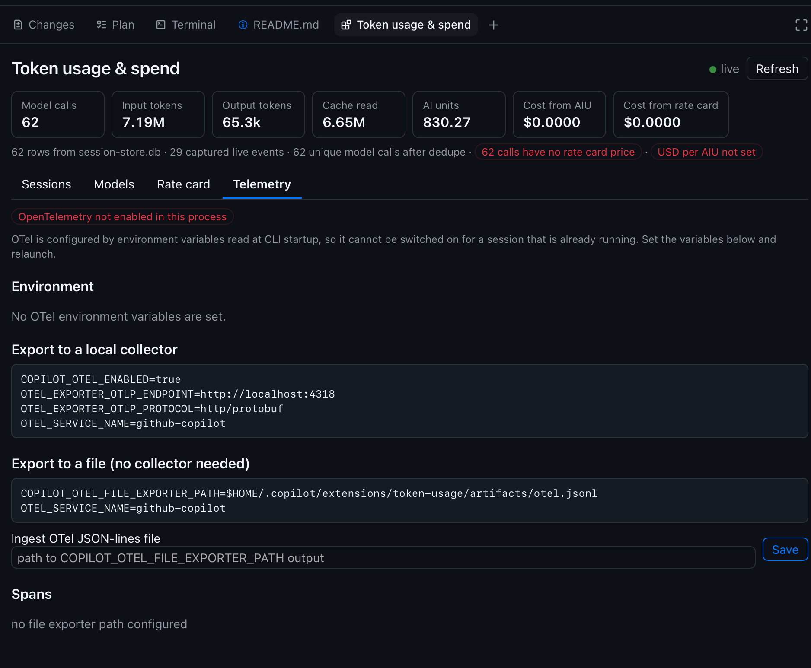

# Token usage &amp; spend — a Copilot CLI canvas extension

Track **token usage, AI units (AIU) and estimated cost per session** inside GitHub Copilot,
with a rate card you can edit and persist by provider, model and reasoning effort.

Repo: [`cicorias/gh-app-canvas-token-usage`](https://github.com/cicorias/gh-app-canvas-token-usage) ·
Extension source: [`token-usage/`](token-usage/)

---

## Quick start

**1. Install** (pick one — the folder-URL route is easiest):

Ask Copilot:

> Install the extension from `https://github.com/cicorias/gh-app-canvas-token-usage/tree/main/token-usage`

or from a clone:

```sh
git clone https://github.com/cicorias/gh-app-canvas-token-usage.git
cd gh-app-canvas-token-usage
./install.sh
```

**2. Reload** — ask Copilot to reload extensions, or restart the CLI.

**3. Open the canvas** — ask Copilot:

> Open the token usage canvas

**4. Set your prices** — go to the **Rate card** tab, click **Add models seen in usage**, then
enter your USD-per-AIU rate and per-million-token prices. Until you do, the token and cost
columns read zero by design: no list prices are shipped or guessed on your behalf.

That's it. Usage from your existing sessions appears immediately — there is nothing to
configure and no telemetry to enable.

---

## What you get

Four tabs — **Sessions**, **Models**, **Rate card**, **Telemetry** — under a summary bar that
is always visible.

### The summary bar (on every tab)

- **Model calls** — total LLM API calls counted, after deduplication.
- **Input tokens** / **Output tokens** — prompt and completion volume. Input *includes* cache
  reads and writes (see the note under [Two cost numbers](#two-cost-numbers-on-purpose)).
- **Cache read** — tokens served from the prompt cache. Usually the large majority of input
  volume on long sessions, and normally billed at a steep discount.
- **AI units** — Copilot's own billing unit, summed from each call's `total_nano_aiu`. This is
  the number that actually maps to what you are charged.
- **Cost from AIU** — AI units × your USD-per-AIU rate.
- **Cost from rate card** — the modelled token cost from your per-1M prices.
- The line underneath is the **provenance and health strip**: how many rows came from
  `session-store.db`, how many live events were captured, how many unique calls remain after
  dedupe, and red pills warning that calls are unpriced or that USD-per-AIU is unset.
- **live** / **Refresh** — the green dot means the Server-Sent Events stream is connected and
  the view updates as calls complete; **Refresh** forces a re-read of the stores.

### Sessions tab



- **Purpose** — answer "what has each session cost me?" Rows are sorted by most recent
  activity, and cover every session on the machine, not just the current one.
- **Session** — the session summary, then the repo and branch, then the first 8 characters of
  the session id. Sessions with no repo fall back to the working directory.
- **Models** — every model used in that session; more than one appears when you switch models
  mid-session or a sub-agent runs on a different one.
- **Calls** — model calls attributed to the session.
- **In** / **Out** / **Cache rd** — token volume, abbreviated (`k` / `M`).
- **AIU** and **AIU $** — AI units consumed and their cost at your USD-per-AIU rate.
- **Rate $** — cost from the rate card, or a red `n/a` pill when any call in the session has
  no matching priced entry.
- **Last activity** — timestamp of the most recent call.
- **Click any row** to drill into a per-call table: timestamp, model, effort, sub-agent
  attribution, every token bucket, AIU, both costs, duration, and whether the row came from
  the database or from live capture.

### Models tab



- **Purpose** — see where the volume and the money actually go, independent of which session
  spent it. Sorted by total tokens.
- **Provider** — inferred from the model name (Anthropic, OpenAI, Google, xAI, Microsoft, …)
  and used as the first key when matching a rate card entry.
- **Model** and **Effort** — the reasoning effort is a separate key because the same model at
  `high` or `max` can cost very differently from `medium`.
- **Sessions** — how many distinct sessions used this combination.
- **Calls**, **In**, **Out**, **Cache rd**, **Reason** — call count and token buckets;
  **Reason** is reasoning/chain-of-thought output tokens.
- **AIU** / **AIU $** — AI units and their cost.
- **Rate $** — modelled cost, or a red `unpriced` pill when this combination has no priced
  rate card entry. That pill is your to-do list for the next tab.

### Rate card tab



- **Purpose** — tell the canvas what things cost. Nothing is shipped or guessed: every price
  is yours, saved to `rate-card.json` outside any repository.
- **USD per AI unit (AIU)** — the single most valuable field. Set it and every AIU column
  turns into real money, with no per-model work at all.
- **cache tokens are already counted inside input tokens** — on by default, because observed
  data shows `inputTokens` includes cache reads and writes. Leaving it on subtracts them from
  billable input so they are not charged twice. Turn it off if your provider reports them
  separately.
- **Add row** — a blank entry. **Add models seen in usage** — one zero-priced row for every
  provider/model/effort combination observed but not yet priced. **Save rate card** — persists
  everything; costs recompute immediately.
- **Provider** / **Model** / **Effort** — the match keys. Use `*` as a wildcard in any of
  them; the most specific match wins, so `*` / `*` / `*` acts as a catch-all default and a
  row naming an exact model and effort overrides it.
- **Input /1M**, **Output /1M**, **Cache read /1M**, **Cache write /1M** — USD per 1,000,000
  tokens for each bucket.
- **Reasoning /1M** — leave **blank** when reasoning tokens are already billed as output
  tokens, which is the common case; filling it in charges them a second time on top.
- **Notes** — free text. Auto-added rows are stamped so you can spot what still needs prices.
- **Delete** — removes the row.

### Telemetry tab



- **Purpose** — optional. Everything above works with no telemetry at all; this tab adds
  span- and tool-level detail, and shows exactly how to switch it on.
- **Status pill** — whether OpenTelemetry is active in the running process. It is configured
  by environment variables read at **CLI startup**, so it cannot be enabled for a session
  that is already running: set the variables and relaunch.
- **Environment** — every OTel variable currently visible to the process, so you can confirm
  what actually took effect rather than what you meant to set.
- **Export to a local collector** — a copyable snippet for OTLP/HTTP to something like Jaeger
  or Grafana on `localhost:4318`.
- **Export to a file (no collector needed)** — a snippet for `COPILOT_OTEL_FILE_EXPORTER_PATH`,
  which writes every signal as JSON-lines. This is the path this canvas can read.
- **Ingest OTel JSON-lines file** — point it at that file and **Save**. The file is tail-read,
  so a large log stays fast.
- **Spans** — once ingested: span counts and total duration by span type
  (`invoke_agent`, `chat`, `execute_tool`), tokens attributed in traces, and a
  **Tool executions** table of call counts and latency per tool. This is the one thing the
  local usage stores cannot tell you — where the *time* goes, as opposed to the tokens.

### From chat

You can also drive it without touching the UI — the canvas exposes `get_summary`,
`get_session_usage`, `set_rate`, `seed_rate_card`, `otel_status` and `refresh` to the agent,
so *"what has this session cost me so far?"* just works.

---

## Requirements

- GitHub Copilot CLI with canvas support
- **Node 22+** — the extension uses the built-in `node:sqlite` module

There are **no dependencies to install**. `@github/copilot-sdk` is resolved by the CLI, so do
not add a `package.json` or `node_modules`.

---

## Installation in detail

### Choose a scope

| Scope | Destination | Who gets it |
| --- | --- | --- |
| **User** | `$COPILOT_HOME/extensions/token-usage/` (default `~/.copilot/extensions/`) | you, in every project |
| **Project** | `<repo>/.github/extensions/token-usage/` | anyone working in that repo, with no install step |
| **Session** | `$COPILOT_HOME/session-state/<sessionId>/extensions/token-usage/` | the current session only |

> A **project**-scope copy shadows a **user**-scope copy of the same name — the user one is
> dropped at discovery time. Don't install both.

### Option 1 — from this repository (recommended)

Ask Copilot to install it, or use the `install_extension` tool, with this folder URL:

```
https://github.com/cicorias/gh-app-canvas-token-usage/tree/main/token-usage
```

You'll be asked which scope to install into. This is the best route for other people:
versioned, reviewable, and easy to update by re-running the install.

### Option 2 — install script

```sh
git clone https://github.com/cicorias/gh-app-canvas-token-usage.git
cd gh-app-canvas-token-usage

./install.sh                            # user scope (default)
./install.sh --project /path/to/repo    # into that repo's .github/extensions/
./install.sh --session <session-id>      # current session only
```

The script warns if Node is older than 22 and prints the destination it used.

### Option 3 — vendor it into your team's repo

```sh
mkdir -p /path/to/repo/.github/extensions
cp -R token-usage /path/to/repo/.github/extensions/
```

Commit it, and everyone working in that repo gets the canvas with **no install step at all**.
Discovery only scans immediate subdirectories of `.github/extensions/`, so keep the folder
exactly one level deep.

### Option 4 — private gist

Run **Share extension as gist…** from the Copilot command palette (or use the
`share_extension` tool), then **Install extension from gist…** on the other machine. Good for
syncing your own machines; use options 1–3 for teams, since a gist isn't reviewable or
versioned.

### Manual copy

Copy the `token-usage/` folder to the destination for your chosen scope. The entry point must
be named exactly `extension.mjs` and sit at the top of that folder.

### Verify

After reloading, ask Copilot to list extensions — `token-usage` should show as **ready**. If
it shows **failed**, ask it to inspect the extension; the output includes the log file path
and a tail of the log.

---

## Updating

Re-run whichever install route you used, then reload extensions. Your rate card and captured
usage are stored outside the extension folder (see below), so they survive updates and
reinstalls.

## Uninstalling

Delete the installed folder for your scope, e.g. `rm -rf ~/.copilot/extensions/token-usage`,
and reload. To also remove your data, delete
`~/.copilot/extensions/token-usage/artifacts/`.

---

## Where your data lives

Everything user-owned is written to `$COPILOT_HOME/extensions/token-usage/artifacts/`,
**outside any repository**, regardless of the scope the extension is installed at — so a
project-scope install never commits pricing data.

| File | Contents |
| --- | --- |
| `rate-card.json` | Rate card entries, USD-per-AIU, cache-accounting flag |
| `live-usage.jsonl` | Captured `assistant.usage` events |
| `settings.json` | Path to an OTel file-exporter JSONL to ingest |

Nothing is sent anywhere. The canvas is served by a loopback HTTP server on an ephemeral
port and reads only local files.

---

## How usage is measured

1. **`$COPILOT_HOME/session-store.db` → `assistant_usage_events`**, read-only via
   `node:sqlite`. Gives full retroactive history across every session and project with zero
   configuration. This schema is internal to the Copilot app, so access is defensive: a
   missing database, table or column yields no rows rather than an error.
2. **The live `assistant.usage` session event.** It is `ephemeral: true` and never reaches the
   session event log, so the extension persists its own normalized copy. This keeps the
   current session accurate before the app flushes rows to the store, and survives a schema
   change in that internal store.
3. **OpenTelemetry file exporter (optional)** for span and tool-execution detail.

The first two are merged and deduplicated on the tuple that identifies a model call, then
pushed to the open canvas over Server-Sent Events.

### Two cost numbers, on purpose

Copilot bills in **AI units**, not raw tokens, and usage rows carry `total_nano_aiu`:

- **Cost from AIU** — `AIU × your USD-per-AIU rate`. Tracks how you are actually billed.
- **Cost from rate card** — a modelled token cost from your per-1M prices. Useful for
  comparing providers or for BYOK endpoints.

> **Cache tokens.** In observed data, `inputTokens` already *includes* cache-read and
> cache-write tokens, so the rate card defaults `cacheTokensIncludedInInput` to on and
> subtracts them from billable input. Turn it off if your provider reports them separately.

---

## Optional: OpenTelemetry

OTel is configured by environment variables read at **CLI startup**, so it cannot be switched
on for a session that is already running — set these and relaunch. The Telemetry tab shows
current status and hands you these snippets.

```sh
# Local collector
COPILOT_OTEL_ENABLED=true
OTEL_EXPORTER_OTLP_ENDPOINT=http://localhost:4318
OTEL_EXPORTER_OTLP_PROTOCOL=http/protobuf
OTEL_SERVICE_NAME=github-copilot
```

```sh
# File exporter — no collector required, and ingestible by this canvas
COPILOT_OTEL_FILE_EXPORTER_PATH="$HOME/.copilot/extensions/token-usage/artifacts/otel.jsonl"
OTEL_SERVICE_NAME=github-copilot
```

Point the Telemetry tab at that JSONL file to see spans and tool-execution timings. An OTLP
collector endpoint is reported but not ingested: that would require a receiver process
outliving every session, for data the local stores already provide.

---

## Troubleshooting

| Symptom | Fix |
| --- | --- |
| Extension not discovered | The entry file must be named `extension.mjs`, one level deep inside `extensions/` |
| Extension shows **failed** | Ask Copilot to inspect it — the log path and tail are the primary debugging surface |
| No history, only live rows | Node is older than 22, so `node:sqlite` is unavailable; the Sessions tab notes when the store can't be read |
| Cost columns are zero | Set your USD-per-AIU and per-model prices on the **Rate card** tab |
| Canvas is blank after an update | Re-open the canvas to reload the iframe against the new port |

---

## Layout

```
.
├── install.sh                   user / project / session installer
└── token-usage/
    ├── copilot-extension.json   manifest (required for gist install)
    ├── extension.mjs            wiring: joinSession, canvas, HTTP server, SSE
    ├── aggregate.mjs            merge + dedupe sources, build rollups
    ├── ratecard.mjs             rate card load/save/match and cost computation
    ├── usagedb.mjs              read-only session-store.db reader
    ├── live.mjs                 assistant.usage capture and JSONL store
    ├── otel.mjs                 OTel env detection, settings, JSONL ingest
    ├── paths.mjs                COPILOT_HOME and artifact path resolution
    └── ui.html                  canvas renderer
```
